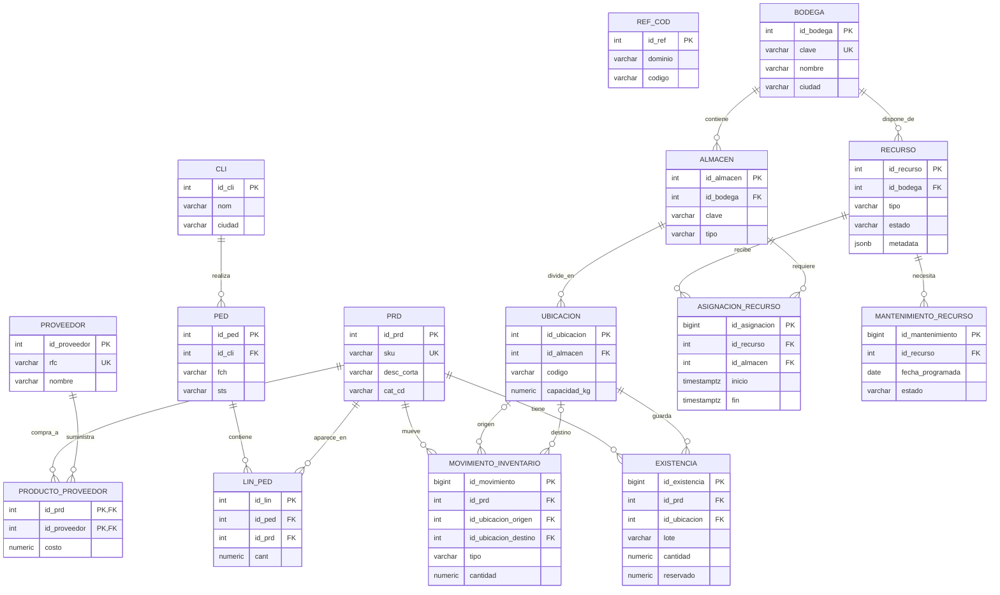

# Base de datos de inventarios

`schema.sql` crea en PostgreSQL dos áreas conectadas:

1. El caso original de ventas de `06-tools`, con datos deliberadamente sucios
   para practicar tools y reglas de interpretación.
2. Un módulo operativo para bodegas, almacenes, existencias, movimientos,
   proveedores y recursos.

El catálogo `prd` conecta ambos mundos: un producto vendido también puede tener
existencias en una o varias ubicaciones.

## Diagrama



## Qué representa cada grupo

### Operación física

- `bodega`: centro físico en una ciudad.
- `almacen`: zona especializada dentro de una bodega; puede ser general,
  refrigerada, de materiales peligrosos o de devoluciones.
- `ubicacion`: posición concreta de almacenamiento, por ejemplo `A-01-02`.

### Inventario

- `existencia`: cantidad y reserva de un producto, lote y ubicación. La
  restricción evita cantidades negativas y reservas mayores al inventario.
- `movimiento_inventario`: bitácora inmutable de entradas, salidas,
  transferencias y ajustes. `referencia_externa` evita procesar dos veces la
  misma operación.
- `vw_inventario_actual`: vista lista para el tablero; calcula disponibilidad y
  alerta de reabasto.

### Abastecimiento

- `proveedor`: datos de contacto y tiempo estimado de entrega.
- `producto_proveedor`: relación muchos-a-muchos con costo, SKU del proveedor y
  opción preferida.

### Recursos

- `recurso`: representa personas, equipos o vehículos. Incluye estado,
  capacidades, habilidades y metadatos específicos.
- `asignacion_recurso`: agenda una actividad para un recurso en un almacén.
- `mantenimiento_recurso`: programa y registra servicios de equipos o vehículos.

## Reglas de negocio importantes

1. Una transferencia requiere origen y destino diferentes.
2. Una entrada solo tiene destino; una salida solo tiene origen.
3. La aplicación debe actualizar `existencia` y crear el movimiento dentro de
   la misma transacción.
4. Ninguna salida puede dejar cantidad negativa.
5. Una `referencia_externa` ya procesada debe devolver el resultado existente,
   no repetir el movimiento.
6. Los recursos en mantenimiento o inactivos no pueden recibir asignaciones.
7. Las fechas de ventas heredadas están en formatos mixtos; las fechas nuevas
   usan tipos `DATE` o `TIMESTAMPTZ`.
8. Para ventas se calcula desde `lin_ped`; no se confía en `ped.mnt_decl` ni en
   `prd.precio_raw`.

## Instalación

```bash
createdb app_inventarios
psql app_inventarios -f schema.sql
```

También puede pegarse el contenido en el SQL Editor de Supabase.

## Consultas de comprobación

```sql
SELECT * FROM vw_inventario_actual ORDER BY bodega, almacen, ubicacion, sku;

SELECT tipo, estado, COUNT(*)
FROM recurso
GROUP BY tipo, estado
ORDER BY tipo, estado;

SELECT *
FROM vw_inventario_actual
WHERE requiere_reabasto;
```
